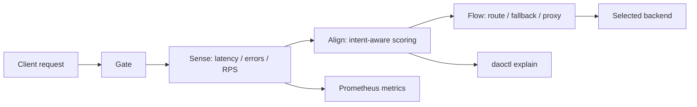

# Grant Evidence Package

Status: reviewer-facing evidence package.

Scope: this document summarizes the current DAO_lim artifact, reproducible reviewer path, evidence assets, explicit non-claims, and near-term product/research roadmap for grant reviewers, pilot customers, and technical evaluators.

## One-sentence claim

DAO_lim is an open-source Rust intent-aware gateway for AI infrastructure that routes traffic across heterogeneous backends using latency, error-rate, load, and request-intent signals, while exposing explainable routing decisions through `daoctl`.

## Core idea

DAO_lim sits between clients and AI/backend services.

```text
request -> gate -> sense backend health -> align intent/load -> route/fallback -> explain decision
```

The goal is to make AI backend routing more adaptive and inspectable than static round-robin or opaque failover.

## Reviewer path

A reviewer can build the current artifact locally:

```bash
cargo build --release
```

Run the gateway:

```bash
./target/release/dao --config configs/dao.toml
```

Inspect routing behavior:

```bash
./target/release/daoctl explain \
  --host llm.myapp.com \
  --path /v1/chat/completions \
  --intent realtime
```

Run tests:

```bash
cargo test
cargo test -p dao-core
```

Review benchmark documentation:

```text
docs/BENCHMARKS.md
```

## Architecture at a glance



DAO_lim is not only a proxy. Its differentiator is explainable backend selection using operational health and request intent.

## Current evidence matrix

| Evidence asset | Reviewer question | Path / command | Current status |
| --- | --- | --- | --- |
| Rust build | Can the gateway and CLI be built? | `cargo build --release` | Implemented |
| Unit tests | Does the Rust workspace validate behavior? | `cargo test`, `cargo test -p dao-core` | Implemented |
| Routing explainability | Can routing decisions be inspected? | `daoctl explain ...` | Implemented CLI path |
| Config examples | Are AI/backend routing rules represented? | `configs/` | Present |
| Metrics | Are latency/errors/RPS exposed? | Prometheus `/metrics` path in README | Documented / implemented path |
| Benchmark report | Is there at least one measured local report? | `docs/BENCHMARKS.md` | Present, local baseline |
| Admin API | Is operational state inspectable? | `daoctl upstreams`, admin API docs in README | Documented |
| Roadmap | Is future infra direction explicit? | README roadmap | Documented |

## What is already implemented

- Rust gateway binary (`dao`).
- CLI inspection tool (`daoctl`).
- Intent-aware route configuration.
- Resonant load-balancing score based on load, intent, and tempo/spikiness concepts.
- Backend health-oriented selection using latency and error signals.
- Fallback behavior when backend health degrades.
- Prometheus metrics orientation.
- Admin/inspection commands for explaining routing decisions.
- WebSocket / HTTP routing direction in README.
- First local benchmark report with environment and caveats.

## Implemented vs measured vs target claims

| Category | Meaning | Current handling |
| --- | --- | --- |
| Implemented | Code paths or docs currently present | Gateway, `daoctl`, config-driven routing, metrics orientation, explain output |
| Measured baseline | A concrete run with host specs and caveats | `docs/BENCHMARKS.md` first local benchmark report |
| Product claim | Intended user-facing value | Adaptive AI backend routing with explainability |
| Roadmap | Planned or in-progress work | gRPC proxy, circuit breaker, full WebSocket proxying, HTTP/3, canary routing, OpenTelemetry, WASM plugins |

Reviewer language should not present the first local benchmark as a universal performance claim.

## What DAO_lim makes inspectable

DAO_lim is designed to make routing behavior inspectable, including:

- which backend was selected,
- why that backend was selected,
- p95 latency and error signals per upstream,
- request intent match/mismatch,
- load/resonance score,
- circuit/failover state,
- backend distribution under test traffic,
- metrics suitable for dashboards.

## Product wedge

DAO_lim has a direct AI infrastructure wedge:

```text
teams run multiple AI backends -> static routing fails under load/failure -> DAO_lim routes by health + intent and explains why
```

Potential pilot users:

- teams running multiple model providers,
- teams with local + cloud model backends,
- AI products that need fallback across latency/cost/quality tiers,
- platform teams needing inspectable LLM gateway decisions,
- teams preparing for agent workloads with different latency/quality profiles.

## Relationship to the Liminal Evidence Stack

DAO_lim is adjacent to the core evidence stack rather than the central safety protocol layer.

- **PythiaLabs:** can gate whether an agent should call a tool or backend.
- **DRP:** can record routing policy or failover decisions when they matter.
- **LTP:** can trace/replay agent execution paths that include backend/tool routing.
- **CML:** can audit whether privileged backend/tool use had valid causal authorization.
- **LiminalDB:** can store routing timelines, metrics, and failover evidence.
- **DAO_lim:** routes AI/backend traffic using health and intent signals.

## What this project does not claim yet

DAO_lim currently does not claim:

- production security gateway certification,
- full replacement of Envoy, NGINX, HAProxy, or cloud load balancers,
- production-grade multi-tenant isolation,
- universal routing optimality,
- verified performance across hardware and workloads,
- complete LLM policy enforcement,
- mature enterprise observability/compliance guarantees,
- stable pre-1.0 API/config compatibility.

The current value is narrower: an open-source Rust prototype/product artifact for intent-aware, explainable AI/backend routing with early benchmark evidence.

## Why this is grant/product-relevant

Agentic AI systems increasingly depend on heterogeneous backend infrastructure: fast models, slow reasoning models, local models, cloud APIs, fallback endpoints, and tool servers.

Static routing hides operational decisions. DAO_lim contributes one infrastructure primitive:

```text
backend health + request intent + explainable score -> inspectable routing decision
```

This can support applied research and product pilots around robust AI infrastructure, model routing, fallback behavior, and operational explainability.

## Research / build roadmap

Near-term work can focus on:

1. **Benchmark hardening** — expand local benchmark into reproducible multi-profile reports.
2. **Comparative baselines** — compare against round-robin and simple latency-only routing under failure/load.
3. **Routing decision schema** — formalize explain output for logs, traces, and downstream audit systems.
4. **OpenTelemetry support** — expose trace spans for routing decisions.
5. **Circuit breaker hardening** — expand failure-mode tests and recovery behavior.
6. **AI-provider adapters** — document patterns for OpenAI-compatible APIs, local model servers, and tool endpoints.
7. **Integration with evidence stack** — store routing decisions in LiminalDB and make high-risk backend/tool calls visible to PythiaLabs/LTP/CML.

## Suggested reviewer checklist

A reviewer can ask:

- Can I build the gateway and CLI locally?
- Can I inspect why a backend was selected?
- Are benchmark caveats explicit?
- Does the project separate implemented behavior from roadmap claims?
- Is the AI infrastructure wedge clear?
- Is the relationship to the evidence stack explicit without overclaiming?

## Current strongest positioning

Use this formulation in outreach or product discussions:

```text
DAO_lim is an open-source Rust intent-aware gateway for AI infrastructure. It routes requests across heterogeneous backends using health, latency, load, and request-intent signals, while exposing explainable routing decisions through a CLI and metrics surface.
```

## Short version

```text
Static round-robin is not enough for AI backends.
DAO_lim routes by health + intent and shows why each backend was selected.
```
